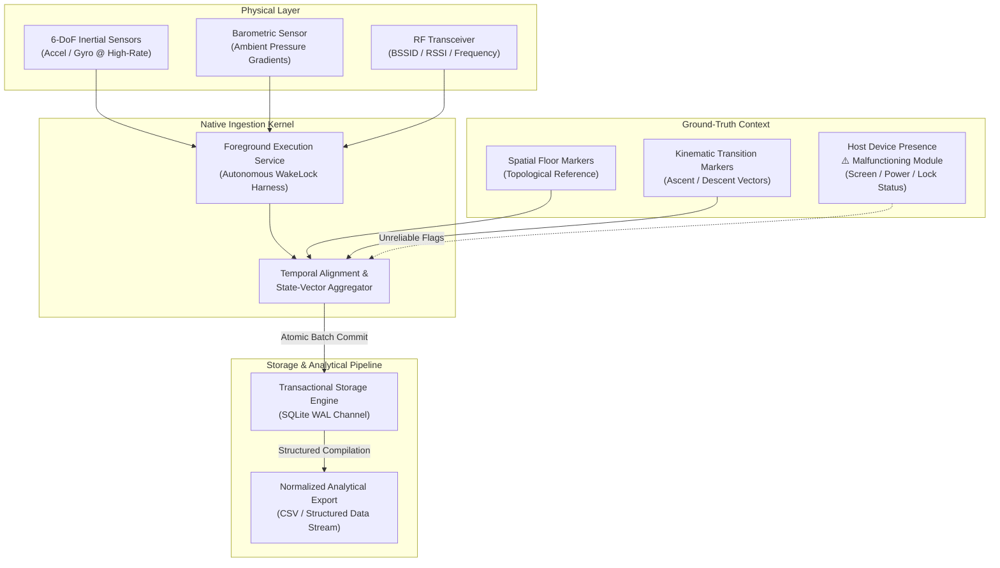

# Ascent

> **Internal Telemetry Harvesting & Multimodal Spatial Dynamics Research Instrument**

---

> [!WARNING]
> ### Project Lifecycle & Operational Status: Terminated / Unmaintained
> **Active development on Ascent has been permanently halted.** The internal research program that commissioned this instrument was terminated midway through execution due to internal reasons. This repository is archived and preserved in its raw state purely as an empirical research artifact.
> 
> **Critical Known Deficiencies & Architectural Anomalies:**
> * **Heavily "Vibecoded" / AI-Generated Codebase:** The major code written to build this tool was generated and orchestrated by **AI agents**, and the application was **majorly developed by AI**. It was rapidly assembled via prompt-driven workflows rather than rigorous, manually audited production engineering, resulting in architectural idiosyncrasies, unpolished failure paths, and fragile edge cases.
> * **Background Execution Failure & Resource Inefficiency:** While architected to harvest continuous telemetry, background processing is severely degraded, highly battery-inefficient, and unstable. In practice, long-running data collection frequently fails or stutters once the host application is backgrounded or subjected to platform power-conservation cycles.
> * **Device Presence & State-Vector Malfunction:** The internal subsystem engineered to track host lifecycle context—specifically the detection of whether the application is running in **Foreground vs. Background** and whether the mobile hardware is in **Lockscreen vs. Offscreen/Active Display** mode—is **malfunctioning and broken**. Ground-truth presence tags (`appState`, `lockScreen`, `screenOn`) emitted by this module should be considered unreliable.

---

## Executive Overview

**Ascent** is an experimental research instrument architected for physical telemetry collection across contested indoor environments. Developed to support an internal empirical study on indoor dead-reckoning, multi-floor spatial mapping, and vertical displacement mechanics, the system was designed to harmonize heterogeneous sensory modalities into an aligned, time-synchronized observation corpus.

Rather than treating device mobility as an abstract application state, Ascent approaches the physical host as an edge-situated telemetry probe. The architecture was engineered to sample high-rate inertial dynamics, atmospheric micro-pressure gradients, and ambient radio-frequency (RF) topologies while pairing the stream with researcher-annotated ground-truth semantics in real time.

```
                  ┌─────────────────────────────────────────┐
                  │        PHYSICAL TELEMETRY DOMAIN        │
                  │   RF Topology • Inertial Dynamics •     │
                  │       Barometric Micro-Gradients        │
                  └────────────────────┬────────────────────┘
                                       │
                                       ▼
                  ┌─────────────────────────────────────────┐
                  │    DAEMONIZED INGESTION CORE (NATIVE)   │
                  │  Deterministic Scheduling • Lock-Free   │
                  │   Wakelock Harness • Thread Isolation   │
                  └─────────┬─────────────────────┬─────────┘
                            │                     │
      Telemetry Stream      │                     │  State Cache
                            ▼                     ▼
┌──────────────────────────────────────┐       ┌────────────────────────────┐
│      PERSISTENCE ENGINE (SQLITE/WAL) │       │   RESEARCH SUPERVISION UI  │
│  Streaming Atomic Writes • Dual-Tick │◄──────┤  Dynamic Ground-Truth Tag  │
│  Normalization • Lossless Ring-Log   │       │  Topological Floor Anchors │
└──────────────────────────────────────┘       └────────────────────────────┘
```

---

## Research Origin & Release Scope

Ascent was conceived and deployed strictly as an **internal data collection utility** for a targeted indoor navigation and kinematic research program. It is **not** an off-the-shelf consumer application, nor is it a generalized framework built for universal application ecosystems.

The codebase has been open-sourced **"as-is"** following the program's premature conclusion. It serves as an architectural reference for empirical sensor collection and edge synchronization pipelines under prototype constraints. Architectural conventions reflect the specific experimental requirements and edge cases of the initial program; generalism and turnkey operation should neither be expected nor inferred.

### Development Provenance: AI Agents & "Vibecoding"
An essential consideration when evaluating this repository is its development lineage: **this tool is heavily "vibecoded"**. The vast majority of the code across both the native platform modules and the host application was **written directly by AI agents**, and the system was **majorly developed by AI**. 

While this agentic methodology facilitated rapid implementation of complex cross-domain synchronization concepts on tight research timelines, it also produced standard artifacts of automated code generation: inconsistent abstraction boundaries, unhandled edge-case states, and experimental patterns. Anyone inspecting or adapting this repository should approach the implementation through this lens.

---

## Architectural Intent & Known Operational Realities

The conceptual design of Ascent targeted four primary telemetry objectives, alongside notable empirical constraints encountered in field execution:

### 1. Decoupled Dual-Domain Execution
Ascent enforces a structural division between the **High-Frequency Ingestion Layer** and the **Research Observation Interface**:
* **The Ingestion Pipeline** was designed to bypass the user-facing thread pool, acquiring and committing sensor streams at the native layer under isolated execution conduits.
* **The Supervisory Interface** serves as a lightweight control harness, providing real-time labeling surfaces without impeding the underlying collection loop.

### 2. Daemonized Foreground Engine & Empirical Limitations
To maintain data collection across spatial transitions, Ascent incorporates a platform foreground service utilizing hardware wakelocks:
* **Architectural Intent:** Provide persistent sampling across active, suspended, and locked display states while contextualizing OS governor interventions.
* **Empirical Reality & Known Flaws:** In live field scenarios, this subsystem exhibits major stability flaws. Execution in the background is neither power-efficient nor reliably continuous. Furthermore, the telemetry module responsible for determining device presence states (**Foreground/Background application states** and **Lockscreen/Screen-On conditions**) is **compromised and malfunctions**, producing erratic or inaccurate environmental state flags.

### 3. Unified Multimodal Telemetry Grid
Ascent was structured to synthesize four complementary sensory channels:
* **High-Rate Inertial Kinetics (IMU):** 6-DoF continuous angular velocity and linear acceleration vectors capturing human locomotion, gait signatures, and kinetic impulses.
* **Atmospheric Micro-Altimetry:** Barometric pressure time-series sensitive to sub-meter atmospheric differentials, designed to resolve vertical displacement vectors (elevators, escalators, and stairwells).
* **Ambient RF Topology:** Periodic interrogation of connected wireless access nodes (BSSID, SSID, carrier frequency, and signal strength attenuations) providing coarse-grained spatial localization anchors.
* **Autonomous Locomotion Classifier:** Heuristic motion-state tracking classifying stationary versus kinetic phases to establish operational baselines.

### 4. Deterministic Dual-Clock Synchronization
To align heterogeneous streams, Ascent captures two distinct temporal metrics per frame:
* **Hardware Monotonic Delta (`sensorTimestamp`):** High-precision ticks sourced directly from native sensor hardware drivers, immune to system clock drifts and network synchronizations.
* **Wall-Clock Coordinated Standard (`timestamp` / `arrivalTimestamp`):** ISO-8601 UTC references stamped upon application arrival, allowing cross-device analytical collation with external telemetry baselines.

---

## Core System Architecture



---

## Data Schema & Observation Modeling

Physical observations are logged into an atomic transactional SQLite persistence engine under WAL journaling. Each capture frame encapsulates the following state vector:

| Telemetry Domain | Observation Attributes | Conceptual Purpose & Operational Status |
| :--- | :--- | :--- |
| **Temporal Coordinate** | `timestamp`, `arrivalTimestamp`, `sensorTimestamp` | Cross-sensor alignment, jitter compensation, and chronometric fidelity. |
| **Inertial Kinetic** | `accelerometer[X,Y,Z]`, `gyroscope[X,Y,Z]` | Dynamic human locomotion modeling, step detection, and micro-movement analysis. |
| **Barometric Pressure** | `barometerPressure` (hPa / mbar) | Differential altimetry, stair navigation vectors, and vertical displacement profiling. |
| **RF Environment** | `bssid`, `ssid`, `signalStrength` (dBm), `frequency` | Spatial fingerprinting, beacon attenuation curves, and indoor dead-reckoning support. |
| **Ground-Truth Anchor** | `floor`, `activity`, `motionState` | Supervised labels for training downstream machine learning and spatial classification models. |
| **Host Lifecycle Context** | `appState`, `lockScreen`, `screenOn`, `deviceModel` | ⚠️ **Malfunctioning:** Intended for hardware governor characterization, but presence flags frequently produce incorrect values. |

---

## Primary Research Applications

The conceptual schema and ingestion pipelines were drafted to advance exploratory research in:

1. **Vertical Odometry & Multi-Story Localization:** Investigating floor-level disambiguation in dense indoor facilities where GNSS positioning is degraded or unavailable.
2. **Pedestrian Dead-Reckoning (PDR):** Fusing high-frequency inertial kinematics with barometric delta curves to model 3D spatial trajectories.
3. **RF Signal Attenuation & Multipath Characterization:** Investigating structural absorption, wall occlusion, and floor boundary effects on 2.4 GHz and 5 GHz electromagnetic propagation.
4. **Behavioral Kinetic Classification:** Validating model inference accuracy for directional stair negotiation, locomotion transitions, and stationary-to-movement boundaries.

---

## License & Operational Terms

This repository is distributed under the terms defined in the [LICENSE](LICENSE) file. As an uncompleted prototype from a terminated internal research project, Ascent is released strictly **"as-is"**, with no warranties of fitness, performance, or correctness. No active maintenance, issue triage, or future feature development is planned.
