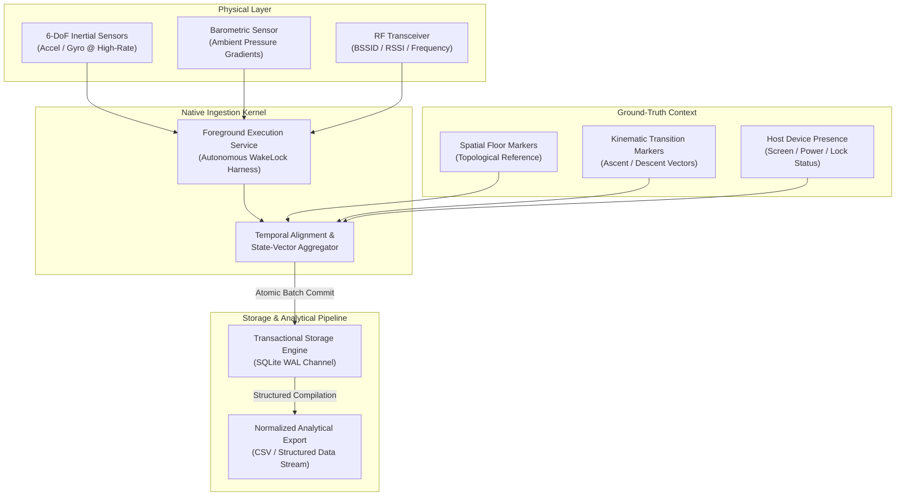

# Ascent

> **Internal Telemetry Harvesting & Multimodal Spatial Dynamics Research Instrument**

---

## Executive Overview

**Ascent** is an experimental research instrument architected for high-fidelity, continuous physical telemetry collection across contested indoor environments. Developed primarily to support an internal empirical study on indoor dead-reckoning, multi-floor spatial mapping, and vertical displacement mechanics, the system harmonizes heterogeneous sensory modalities into an aligned, time-synchronized observation corpus.

Rather than treating device mobility as an abstract application state, Ascent treats the physical host as an autonomous, edge-situated telemetry probe. The architecture continuously samples high-rate inertial dynamics, atmospheric micro-pressure gradients, and ambient radio-frequency (RF) topologies while anchoring the resulting time series to researcher-annotated ground-truth semantics in real time.

```
                  ┌─────────────────────────────────────────┐
                  │        PHYSICAL TELEMETRY DOMAIN        │
                  │   RF Topology • Inertial Dynamics •     │
                  │       Barometric Micro-Gradients        │
                  └────────────────────┬────────────────────┘
                                       │
                                       ▼
                  ┌─────────────────────────────────────────┐
                  │    DAEMONIZED INGESTION CORE (NATIVE)   │
                  │  Deterministic Scheduling • Lock-Free   │
                  │   Wakelock Harness • Thread Isolation   │
                  └─────────┬─────────────────────┬─────────┘
                            │                     │
      Telemetry Stream      │                     │  State Cache
                            ▼                     ▼
┌──────────────────────────────────────┐       ┌────────────────────────────┐
│      PERSISTENCE ENGINE (SQLITE/WAL) │       │   RESEARCH SUPERVISION UI  │
│  Streaming Atomic Writes • Dual-Tick │◄──────┤  Dynamic Ground-Truth Tag  │
│  Normalization • Lossless Ring-Log   │       │  Topological Floor Anchors │
└──────────────────────────────────────┘       └────────────────────────────┘
```

---

## Research Origin & Release Scope

> **Notice on System Generality & Open-Source Scope**
> 
> Ascent was conceived and deployed strictly as an **internal data collection utility** for a targeted indoor navigation and kinematic research program. It is **not** an off-the-shelf consumer application, nor is it a generalized framework built for universal application ecosystems.
> 
> The codebase has been open-sourced **"as-is"** to serve as an architectural reference for empirical data harvesting, edge sensor synchronization, and robust background persistence strategies. Architectural conventions reflect the specific constraints, operational edge cases, and hardware behaviors encountered during live research campaigns. Generalism should neither be expected nor inferred.

---

## Architectural Pillars

The design of Ascent addresses the primary dilemma of mobile telemetry: achieving microsecond-grade sensor fidelity without degradation from operating system power management, thread preemption, or application execution boundaries.

### 1. Decoupled Dual-Domain Execution
Ascent enforces strict physical separation between the **High-Frequency Ingestion Layer** and the **Research Observation Interface**:
* **The Ingestion Pipeline** is decoupled from the user-facing thread pool. Sensor streams are acquired, normalized, and committed at the lowest platform-accessible native layer, operating under isolated execution conduits.
* **The Supervisory Interface** acts as an observer and control harness. It renders low-frequency telemetry summaries, hardware health monitors, and provides real-time labeling surfaces without introducing backpressure or scheduling jitter into the primary data path.

### 2. Autonomous Telemetry Daemonization
To guarantee uninterrupted data continuity across complex spatial transitions, Ascent incorporates an autonomous foreground execution daemon. By negotiating non-preemptible execution locks and specialized platform service profiles, the capture engine maintains continuous sampling cycles regardless of application state transitions:
* **Background Invariance:** Telemetry collection persists unabated across active usage, background suspension, and locked-display states.
* **State-Aware Contextual Framing:** Every ingested data frame records host lifecycle metrics (display power status, lockscreen status, foreground/background posture) to allow downstream researchers to isolate sensor noise caused by OS energy governors.

### 3. Unified Multimodal Telemetry Grid
Ascent continuously synthesizes four complementary sensory layers:
* **High-Rate Inertial Kinetics (IMU):** 6-DoF continuous angular velocity and linear acceleration vectors capturing human locomotion, gait signatures, and kinetic impulses.
* **Atmospheric Micro-Altimetry:** Barometric pressure time-series sensitive to sub-meter atmospheric differentials, vital for resolving vertical displacement vectors (elevators, escalators, and stairwells).
* **Ambient RF Topology:** Periodic interrogation of connected wireless access nodes (BSSID, SSID, carrier frequency, and signal strength attenuations) providing coarse-grained spatial localization anchors.
* **Autonomous Locomotion Classifier:** Continuous motion-state tracking classifying stationary versus kinetic phases to establish operational baselines.

### 4. Deterministic Dual-Clock Synchronization
Data integrity in distributed sensor fusion hinges on temporal determinism. Ascent implements a dual-clock timestamping methodology:
* **Hardware Monotonic Delta (`sensorTimestamp`):** High-precision ticks sourced directly from native sensor hardware drivers, immune to system clock drifts and network synchronizations.
* **Wall-Clock Coordinated Standard (`timestamp` / `arrivalTimestamp`):** ISO-8601 UTC references stamped upon application arrival, allowing cross-device analytical collation with external telemetry baselines.

---

## Core System Architecture



---

## Data Schema & Observation Modeling

Ascent records physical reality as discrete, schema-enforced observations within an atomic transactional persistence engine. Each capture frame encapsulates the full operational state vector:

| Telemetry Domain | Observation Attributes | Conceptual Purpose |
| :--- | :--- | :--- |
| **Temporal Coordinate** | `timestamp`, `arrivalTimestamp`, `sensorTimestamp` | Cross-sensor alignment, jitter compensation, and chronometric fidelity. |
| **Inertial Kinetic** | `accelerometer[X,Y,Z]`, `gyroscope[X,Y,Z]` | Dynamic human locomotion modeling, step detection, and micro-movement analysis. |
| **Barometric Pressure** | `barometerPressure` (hPa / mbar) | Differential altimetry, stair navigation vectors, and vertical displacement profiling. |
| **RF Environment** | `bssid`, `ssid`, `signalStrength` (dBm), `frequency` | Spatial fingerprinting, beacon attenuation curves, and indoor dead-reckoning support. |
| **Ground-Truth Anchor** | `floor`, `activity`, `motionState` | Supervised labels for training downstream machine learning and spatial classification models. |
| **System Provenance** | `appState`, `lockScreen`, `screenOn`, `deviceModel` | Environmental telemetry context and hardware governor characterization. |

---

## Primary Research Applications

Data harvested via Ascent is purpose-built to advance research in:

1. **Vertical Odometry & Multi-Story Localization:** Resolving floor-level ambiguity in indoor facilities where satellite-based positioning is unavailable or degraded.
2. **Pedestrian Dead-Reckoning (PDR):** Fusing high-frequency inertial kinematics with barometric delta curves to track continuous 3D spatial trajectories.
3. **RF Signal Attenuation & Multipath Characterization:** Investigating structural absorption, wall occlusion, and floor boundary effects on 2.4 GHz and 5 GHz electromagnetic propagation.
4. **Behavioral Kinetic Classification:** Validating model inference accuracy for directional stair negotiation, locomotion transitions, and stationary-to-movement boundaries.

---

## License & Operational Terms

This repository is distributed under the terms defined in the [LICENSE](LICENSE) file. As an artifact of an internal research initiative, Ascent is released without warranties of commercial fitness or turnkey deployment guarantees. Research teams deploying this tool are encouraged to adapt the native ingestion harness to their specific hardware profiles and collection protocols.
