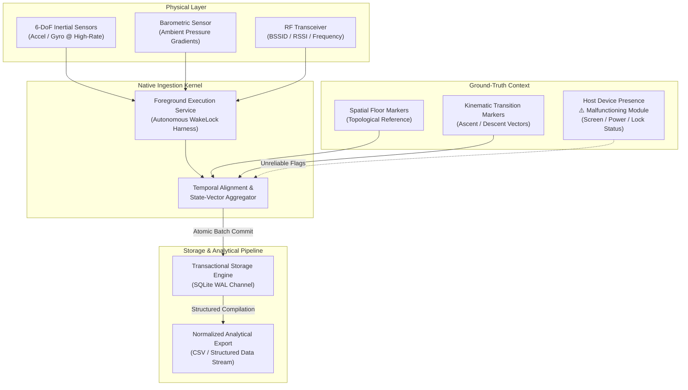

# Ascent

> **Internal Telemetry Harvesting & Multimodal Spatial Dynamics Research Instrument**

[](LICENSE)

---

> [!NOTE]
> ### Project Status: Independent Continuation & Transition to Phase 2
> **While the institutional research program that originally commissioned this tool was terminated midway through execution due to internal reasons, this project is being continued independently.**
> 
> **Current Direction & Operational Strategy:**
> * **Advancing to Phase 2 (All Code in this Repo):** Research is progressing into **Phase 2: Building the Supervised Machine Learning Classifier**. All code for Phase 2—including data sanitization, multimodal feature engineering, and model training—will be developed and maintained directly within this repository.
> * **Foreground-Only Collection Strategy:** The author is **not fixing Ascent itself** right now. Because Ascent's principal bottleneck is background unreliability, dataset generation is proceeding pragmatically by running the capture tool strictly in the **foreground**.
> * **Generalized Training Pipeline:** The long-term objective is to provide a turnkey framework enabling researchers and developers to harvest their own spatial datasets and train custom floor-detection classifiers for their own multi-story facilities.
> * **Community Call to Maintain Phase 1 (Ascent Core):** While the author focuses on building Phase 2 (ML classification), **the open-source community is invited to actively maintain and improve Phase 1—the Ascent application and its data collection engine**. Community stewardship will turn this experimental prototype into a smooth, reliable, and generalized data collection instrument for the entire research community. Review the [Contributing Guide](CONTRIBUTING.md) to get involved!
> 
> **Critical Known Deficiencies in Ascent:**
> * **Heavily "Vibecoded" / AI-Generated Codebase:** The major code written to build this tool was generated and orchestrated by **AI agents**, and the application was **majorly developed by AI**. It was rapidly assembled via prompt-driven workflows rather than manually audited production engineering, resulting in architectural idiosyncrasies and fragile edge cases.
> * **Background Execution Failure & Resource Inefficiency:** While architected to harvest continuous telemetry, background processing is severely degraded, highly battery-inefficient, and unstable. In practice, long-running collection frequently stutters or halts once backgrounded.
> * **Device Presence & State-Vector Malfunction:** The internal subsystem engineered to detect host lifecycle context—specifically determining whether the application is running in **Foreground vs. Background** and whether the phone is in **Lockscreen vs. Offscreen/Active Display** mode—is **malfunctioning and broken**. Ground-truth presence tags (`appState`, `lockScreen`, `screenOn`) emitted by this module should be considered unreliable.

---

## Executive Overview

**Ascent** is an experimental research instrument architected for physical telemetry collection across contested indoor environments. Developed to support an internal empirical study on indoor dead-reckoning, multi-floor spatial mapping, and vertical displacement mechanics, the system was designed to harmonize heterogeneous sensory modalities into an aligned, time-synchronized observation corpus.

Rather than treating device mobility as an abstract application state, Ascent approaches the physical host as an edge-situated telemetry probe. The architecture was engineered to sample high-rate inertial dynamics, atmospheric micro-pressure gradients, and ambient radio-frequency (RF) topologies while pairing the stream with researcher-annotated ground-truth semantics in real time.

```
                  ┌─────────────────────────────────────────┐
                  │        PHYSICAL TELEMETRY DOMAIN        │
                  │   RF Topology • Inertial Dynamics •     │
                  │       Barometric Micro-Gradients        │
                  └────────────────────┬────────────────────┘
                                       │
                                       ▼
                  ┌─────────────────────────────────────────┐
                  │    DAEMONIZED INGESTION CORE (NATIVE)   │
                  │  Deterministic Scheduling • Lock-Free   │
                  │   Wakelock Harness • Thread Isolation   │
                  └─────────┬─────────────────────┬─────────┘
                            │                     │
      Telemetry Stream      │                     │  State Cache
                            ▼                     ▼
┌──────────────────────────────────────┐       ┌────────────────────────────┐
│      PERSISTENCE ENGINE (SQLITE/WAL) │       │   RESEARCH SUPERVISION UI  │
│  Streaming Atomic Writes • Dual-Tick │◄──────┤  Dynamic Ground-Truth Tag  │
│  Normalization • Lossless Ring-Log   │       │  Topological Floor Anchors │
└──────────────────────────────────────┘       └────────────────────────────┘
```

---

## Research Origin & Release Scope

Ascent was conceived and deployed strictly as an **internal data collection utility** for a targeted indoor navigation and kinematic research program. It is **not** an off-the-shelf consumer application, nor is it a generalized framework built for universal application ecosystems.

The codebase has been open-sourced **"as-is"** following the program's premature conclusion. It serves as an architectural reference for empirical sensor collection and edge synchronization pipelines under prototype constraints. Architectural conventions reflect the specific experimental requirements and edge cases of the initial program; generalism and turnkey operation should neither be expected nor inferred.

### Development Provenance: AI Agents & "Vibecoding"
An essential consideration when evaluating this repository is its development lineage: **this tool is heavily "vibecoded"**. The vast majority of the code across both the native platform modules and the host application was **written directly by AI agents**, and the system was **majorly developed by AI**. 

While this agentic methodology facilitated rapid implementation of complex cross-domain synchronization concepts on tight research timelines, it also produced standard artifacts of automated code generation: inconsistent abstraction boundaries, unhandled edge-case states, and experimental patterns. Anyone inspecting or adapting this repository should approach the implementation through this lens.

---

## The Original Research Mandate: Two-Floor ML Classification

The original objective of this research initiative was to solve a specific vertical localization challenge: **autonomously predicting whether an individual is located on Floor 1 or Floor 2** inside a multi-story facility without relying on specialized external beacon infrastructure.

To achieve this, the program was architected around a two-phase machine learning roadmap:

```
┌─────────────────────────────────────────────────────────────────────────┐
│              PHASE 1: MULTIMODAL INGESTION & ANNOTATION (ASCENT)        │
│                                                                         │
│  [ Floor 1 Telemetry ]       [ Transition Dynamics ]     [ Floor 2 Telemetry ]
│    • Stationary Wi-Fi          • Stair Ascent/Descent      • Stationary Wi-Fi 
│    • Baseline Pressure         • Inertial Trajectories     • Baseline Pressure
│    • Ambient Kinetics          • Pressure Gradient Shifts  • Ambient Kinetics 
│                                                                         │
│                  Researcher Ground-Truth Manual Labeling                 │
│              (FLOOR_1  •  FLOOR_2  •  VERTICAL TRANSITION)              │
└────────────────────────────────────┬────────────────────────────────────┘
                                     │
                                     ▼
┌─────────────────────────────────────────────────────────────────────────┐
│           PHASE 2: SUPERVISED MACHINE LEARNING CLASSIFIER (PLANNED)     │
│                                                                         │
│        Multimodal Feature Fusion (RF Signatures + Kinetic IMU + Baro)   │
│                                    │                                    │
│                                    ▼                                    │
│                 Autonomous Discrete Floor Prediction                    │
│                        [ FLOOR 1  vs.  FLOOR 2 ]                        │
└─────────────────────────────────────────────────────────────────────────┘
```

1. **Phase 1 — Empirical Telemetry Harvesting & Ground-Truth Annotation (The Ascent Tool):**
   Prior to model training, high-density sensor and RF data had to be systematically harvested across three distinct operational regimes:
   * Steady-state presence on **Floor 1** (e.g., ground-level strength zones).
   * Steady-state presence on **Floor 2** (e.g., upper-level cardio zones).
   * The kinetic **Transition State** between floors (navigating stairwells, escalators, or vertical corridors).
   
   Ascent was engineered specifically as the fieldwork tool for this phase—continuously streaming raw 6-DoF inertial dynamics, atmospheric barometric pressure deltas, and Wi-Fi signal characteristics (RSSI, BSSID, carrier bands) while field researchers manually injected live ground-truth markers (`FLOOR_1`, `FLOOR_2`, `GOING_UPSTAIRS`, `COMING_DOWNSTAIRS`) directly into the persistence pipeline.

2. **Phase 2 — Multimodal Machine Learning Classifier (Planned Post-Collection):**
   The planned second phase was to ingest this synchronously labeled dataset into a machine learning classification pipeline. The model was to learn spatial-RF fingerprinting correlated with atmospheric altitude gradients and gait kinematics, enabling autonomous, real-time prediction of whether a mobile device resides on **Floor 1** or **Floor 2**.

Although the institutional research program was halted during Phase 1, **this research is being actively continued independently**. The focus has shifted directly into executing Phase 2: collecting the initial dataset in the foreground and training the ML classifier, with all subsequent development living in this repository.

---

## Architectural Intent & Known Operational Realities

The conceptual design of Ascent targeted four primary telemetry objectives, alongside notable empirical constraints encountered in field execution:

### 1. Decoupled Dual-Domain Execution
Ascent enforces a structural division between the **High-Frequency Ingestion Layer** and the **Research Observation Interface**:
* **The Ingestion Pipeline** was designed to bypass the user-facing thread pool, acquiring and committing sensor streams at the native layer under isolated execution conduits.
* **The Supervisory Interface** serves as a lightweight control harness, providing real-time labeling surfaces without impeding the underlying collection loop.

### 2. Daemonized Foreground Engine & Empirical Limitations
To maintain data collection across spatial transitions, Ascent incorporates a platform foreground service utilizing hardware wakelocks:
* **Architectural Intent:** Provide persistent sampling across active, suspended, and locked display states while contextualizing OS governor interventions.
* **Empirical Reality & Known Flaws:** In live field scenarios, this subsystem exhibits major stability flaws. Execution in the background is neither power-efficient nor reliably continuous. Furthermore, the telemetry module responsible for determining device presence states (**Foreground/Background application states** and **Lockscreen/Screen-On conditions**) is **compromised and malfunctions**, producing erratic or inaccurate environmental state flags.

### 3. Unified Multimodal Telemetry Grid
Ascent was structured to synthesize four complementary sensory channels:
* **High-Rate Inertial Kinetics (IMU):** 6-DoF continuous angular velocity and linear acceleration vectors capturing human locomotion, gait signatures, and kinetic impulses.
* **Atmospheric Micro-Altimetry:** Barometric pressure time-series sensitive to sub-meter atmospheric differentials, designed to resolve vertical displacement vectors (elevators, escalators, and stairwells).
* **Ambient RF Topology:** Periodic interrogation of connected wireless access nodes (BSSID, SSID, carrier frequency, and signal strength attenuations) providing coarse-grained spatial localization anchors.
* **Autonomous Locomotion Classifier:** Heuristic motion-state tracking classifying stationary versus kinetic phases to establish operational baselines.

### 4. Deterministic Dual-Clock Synchronization
To align heterogeneous streams, Ascent captures two distinct temporal metrics per frame:
* **Hardware Monotonic Delta (`sensorTimestamp`):** High-precision ticks sourced directly from native sensor hardware drivers, immune to system clock drifts and network synchronizations.
* **Wall-Clock Coordinated Standard (`timestamp` / `arrivalTimestamp`):** ISO-8601 UTC references stamped upon application arrival, allowing cross-device analytical collation with external telemetry baselines.

---

## Core System Architecture



---

## Data Schema & Observation Modeling

Physical observations are logged into an atomic transactional SQLite persistence engine under WAL journaling. Each capture frame encapsulates the following state vector:

| Telemetry Domain | Observation Attributes | Conceptual Purpose & Operational Status |
| :--- | :--- | :--- |
| **Temporal Coordinate** | `timestamp`, `arrivalTimestamp`, `sensorTimestamp` | Cross-sensor alignment, jitter compensation, and chronometric fidelity. |
| **Inertial Kinetic** | `accelerometer[X,Y,Z]`, `gyroscope[X,Y,Z]` | Dynamic human locomotion modeling, step detection, and micro-movement analysis. |
| **Barometric Pressure** | `barometerPressure` (hPa / mbar) | Differential altimetry, stair navigation vectors, and vertical displacement profiling. |
| **RF Environment** | `bssid`, `ssid`, `signalStrength` (dBm), `frequency` | Spatial fingerprinting, beacon attenuation curves, and indoor dead-reckoning support. |
| **Ground-Truth Anchor** | `floor`, `activity`, `motionState` | Supervised labels for training downstream machine learning and spatial classification models. |
| **Host Lifecycle Context** | `appState`, `lockScreen`, `screenOn`, `deviceModel` | ⚠️ **Malfunctioning:** Intended for hardware governor characterization, but presence flags frequently produce incorrect values. |

---

## Primary Research Applications

The conceptual schema and ingestion pipelines were drafted to advance exploratory research in:

1. **Vertical Odometry & Multi-Story Localization:** Investigating floor-level disambiguation in dense indoor facilities where GNSS positioning is degraded or unavailable.
2. **Pedestrian Dead-Reckoning (PDR):** Fusing high-frequency inertial kinematics with barometric delta curves to model 3D spatial trajectories.
3. **RF Signal Attenuation & Multipath Characterization:** Investigating structural absorption, wall occlusion, and floor boundary effects on 2.4 GHz and 5 GHz electromagnetic propagation.
4. **Behavioral Kinetic Classification:** Validating model inference accuracy for directional stair negotiation, locomotion transitions, and stationary-to-movement boundaries.

---

## Independent Roadmap: Phase 2 & Open-Source Community Collaboration

While the original institutional program ended, this repository is not abandoned. The author is actively and independently driving the research forward into its next phase.

### 1. The Phase 2 Machine Learning Pipeline
* **All Phase 2 Code Will Live Here:** Development is shifting into feature extraction, data curation, and model architecture engineering. All preprocessing scripts, training workflows, model definitions, and inference benches will be developed and committed directly within this repository.
* **Foreground-Only Collection Strategy:** Ascent itself is **not being refactored by the author right now**. Since the primary flaw in Ascent is background execution degradation, dataset acquisition is proceeding pragmatically by operating the application strictly in the **foreground**. This completely bypasses OS background battery-throttling and guarantees uncorrupted, high-frequency telemetry.

### 2. Generalized "Bring-Your-Own-Dataset" Framework
The long-term vision of this independent project is to build an open, self-service setup for indoor localization:
* **Universal Telemetry Harvesting:** Providing an open workflow where anyone can record their own paired RF and kinetic telemetry across multi-story buildings.
* **Custom Classifier Training:** Enabling researchers and developers to train their own tailored floor-prediction models on their own custom spaces (e.g., custom office layouts, gym facilities, or residential buildings).

### 3. Open-Source Call to Maintain Phase 1 (Ascent Collection Engine)
Because the author’s active development bandwidth is dedicated to **Phase 2 (building the ML classifier and generalized framework)**, we are explicitly inviting the **open-source community to take on the maintenance and evolution of Phase 1**—the Ascent mobile application and its native telemetry collection engine.

Ascent was engineered as a fast, internal research prototype and carries significant experimental debt. We invite open-source engineers, mobile developers, and sensor enthusiasts to help maintain Phase 1 and build a **smooth, robust, and generalized data-collection experience** for the entire community:
1. **Background Reliability & Battery Optimization:** Re-architect the native background execution service (`RecordingImuService`) to eliminate excessive wake-lock battery drain, prevent aggressive OEM task-killers from terminating capture sessions, and enable reliable background collection.
2. **Device Presence & State-Vector Module:** Debug and repair the broken lifecycle detection module responsible for accurately logging application status (`appState`: foreground vs. background) and display states (`lockScreen` and `screenOn`).
3. **Hardware Generalization & Smooth UX:** Broaden device compatibility across diverse Android chipsets and OEMs, harden high-rate IMU ring-buffers, and refine session management/exporting to make custom dataset collection seamless for non-technical researchers.

By actively maintaining Phase 1, the community can help transform Ascent into an indispensable, turnkey sensor collection instrument. Please review the [Contributing Guide](CONTRIBUTING.md) for contribution tracks, technical details, and PR submission guidelines.

---

## Repository Governance & Community Guidelines

| Document | Description |
| :--- | :--- |
| [Contributing Guide](CONTRIBUTING.md) | Contribution tracks (ML vs. Native Core), PR workflow, and development setup. |
| [Code of Conduct](CODE_OF_CONDUCT.md) | Community standards, pledge, and enforcement responsibilities. |
| [Security & Privacy Policy](SECURITY.md) | Local-first guarantees, spatial/RF privacy disclosures, and vulnerability reporting. |
| [License](LICENSE) | Terms of distribution and reuse (MIT License). |

---

## License & Operational Terms

This project is open-source software licensed under the **[MIT License](LICENSE)**.

Ascent is released **"as-is"** as an empirical research prototype. While the author continues independent development on the Phase 2 machine learning pipeline within this repository, contributions from the community to stabilize Ascent's capture core are openly encouraged under the same MIT license terms.

